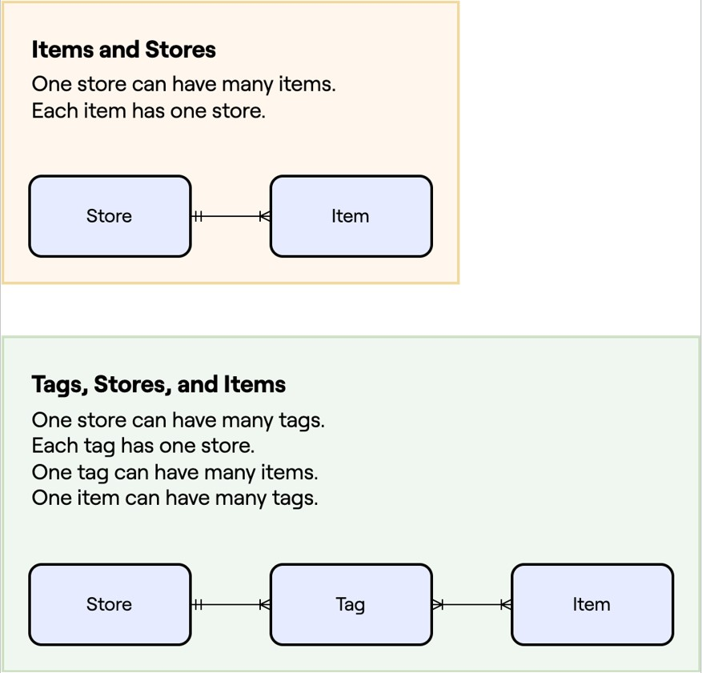

## ⚠️ RELATIONSHIP
- In SQLAlchemy, it is a combination of both the **ForeignKey()** and the **relationship()** that determines the type of relationship
    
    - ### 1. KEY ELEMENTS
        - #### 1.1. FOREIGNKEY()
            - The ForeignKey in the child table defines the basic link between two tables
            - It indicates that the value in one column of the child table refers to a row in the parent table
            - However, on its own, a ForeignKey doesn't specify the type of relationship 
            - It just establishes a reference between two tables

        - #### 1.2. RELATIONSHIP()
            - The relationship() function defines the direction and nature of the relationship
            - It uses the ForeignKey to understand how the tables are related, but the parameters in relationship() <br>
            such as back_populates, uselist etc, influence the type of relationship

## ⚠️ ONE-TO-ONE 
- ForeignKey still defines the link, but you need to add **uselist=False** in the relationship() on the **parent side** to indicate that only one child record can be related

```python
class UserModel(db.Model):
    __tablename__ = "users"
    id = db.Column(db.Integer, primary_key=True)
    profile = db.relationship("ProfileModel", uselist=False, back_populates="user")  # One-to-one

class ProfileModel(db.Model):
    __tablename__ = "profiles"
    id = db.Column(db.Integer, primary_key=True)
    user_id = db.Column(db.Integer, db.ForeignKey("users.id"))
    user = db.relationship("UserModel", back_populates="profile")
```

- ## ⚠️ RELATIONSHIP TYPE (ONE-TO-ONE)
        - #### 2.2. ONE-TO-MANY
            - The ForeignKey in the child table defines the basic link between two tables
            - It indicates that the value in one column of the child table refers to a row in the parent table
            - However, on its own, a ForeignKey doesn't specify the type of relationship 
            - It just establishes a reference between two tables

        - #### 2.3. MANY-TO-MANY
            - The ForeignKey in the child table defines the basic link between two tables
            - It indicates that the value in one column of the child table refers to a row in the parent table
            - However, on its own, a ForeignKey doesn't specify the type of relationship 
            - It just establishes a reference between two tables
            
Relationship Types:
1. One-to-Many (Most common):
ForeignKey in the child table (many side).
relationship() in the parent table (one side), often with uselist=True (the default).
This is the default case where a single row in the parent table can relate to multiple rows in the child table.
Example:

python
Copy code
class StoreModel(db.Model):
    __tablename__ = "stores"
    id = db.Column(db.Integer, primary_key=True)
    items = db.relationship("ItemModel", back_populates="store")  # One-to-many relationship

class ItemModel(db.Model):
    __tablename__ = "items"
    id = db.Column(db.Integer, primary_key=True)
    store_id = db.Column(db.Integer, db.ForeignKey("stores.id"))  # ForeignKey
    store = db.relationship("StoreModel", back_populates="items")
2. One-to-One:
.
Example:

python
Copy code

3. Many-to-Many:
This requires a third table (association table) that links two tables with ForeignKeys from both.
The relationship() defines the connection with secondary pointing to the association table.
Example:

python
Copy code
# Association table
student_course_table = db.Table('student_course',
    db.Column('student_id', db.Integer, db.ForeignKey('students.id')),
    db.Column('course_id', db.Integer, db.ForeignKey('courses.id'))
)

class StudentModel(db.Model):
    __tablename__ = 'students'
    id = db.Column(db.Integer, primary_key=True)
    courses = db.relationship('CourseModel', secondary=student_course_table, back_populates='students')

class CourseModel(db.Model):
    __tablename__ = 'courses'
    id = db.Column(db.Integer, primary_key=True)
    students = db.relationship('StudentModel', secondary=student_course_table, back_populates='courses')
Summary:
ForeignKey is required to link tables, but relationship() defines the nature of how tables interact with each other.
For one-to-many: ForeignKey in the child and relationship() in the parent.
For one-to-one: Add uselist=False to the relationship() in the parent.
For many-to-many: Use an association table and secondary in relationship()


