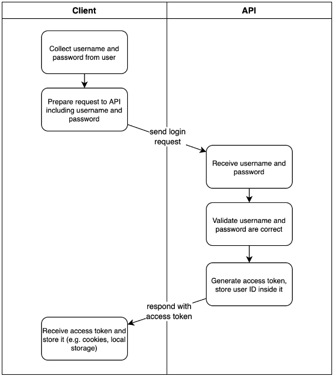

## ⚠️ JWT - JSON WEB TOKEN 
- The Flask app will generate a JWT when a user logs in with their username and password and we can prove our app generated the JWT through its signature 
- Inside the JWT, we'll store the user ID and send it as a response where The client then stores the JWT and sends it to us on every request
- Since the JWT includes the user ID inside it, when we receive a JWT we know who logged in to get the JWT and we can treat requests that include a JWT as "logged in"
- example: if we want certain endpoints to only be accessible to logged-in users, all we do is require a JWT in them Since the client can only get a JWT after logging in, we know that including a JWT is proof that the client logged in successfully at some point in the past

    - ### USE CASE
        - This is the most common scenario for using JWT, once the user is logged in, each subsequent request will include the JWT, allowing the user to access routes, services, and resources that are permitted with that token 
        - Single Sign On is a feature that widely uses JWT nowadays, because of its small overhead and its ability to be easily used across different domains

    - ### SECURE INFORMATION EXCHANGE
        - JSON Web Tokens are a good way of securely transmitting information between parties, because JWTs can be signed
        - example:  using public/private key pairs—you can be sure the senders are who they say they are. Additionally, as the signature is calculated using the header and the payload, you can also verify that the content hasn't been tampered with

## ⚠️ JSON WEB TOKEN STRUCTURE
- In its compact form, JSON Web Tokens consist of three parts separated by dots (.), which are
    - Header
    - Payload
    - Signature

- Therefore, a JWT typically looks like the following `xxxxx.yyyyy.zzzzz`
- [For More Info](https://jwt.io/introduction)

## 🔴 NOTE
- **AUTHENTICATION**
    - Authentication is the process of verifying who a user is claiming to be or simply **logging in**
    - example: me entering my username & password (after registering) to enter in a website

- **AUTHORIZATION**
    - Authorization is the process of verifying what the authenticated users have access to
    - example: me being an authenticated **user** couldn't be able to access the **admin** pages 

