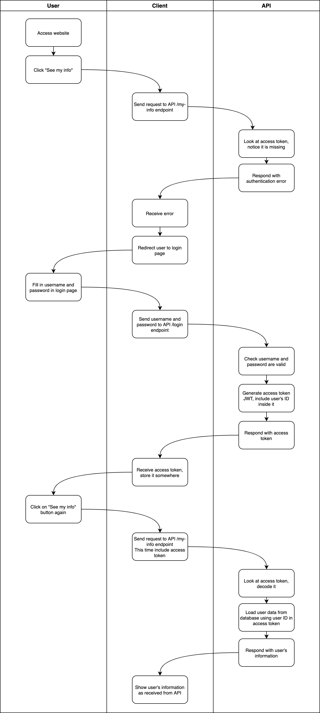

## ⚠️ JWT ACCESS TOKEN
- An **access token** is a general name and **JWT** is a specific type of access token

| Feature                      | Access Token (general)                           | JWT Token (specific)                             |
|------------------------------|--------------------------------------------------|--------------------------------------------------|
| **Structure**                | Can be opaque (random string) or structured      | Always structured: Header, Payload, Signature    |
| **Storage on Server**        | May require server-side storage for validation   | Does not require server storage (self-contained) |
| **Data Contained**           | Usually a reference to data stored on the server | Contains user info directly in the token         |
| **Signature**                | Not necessarily signed                           | Always signed for integrity and authenticity     |
| **Lifespan**                 | Short-lived                                      | Short-lived                                      |
| **Validation**               | Validated by server (e.g., checking database)    | Validated by checking signature and claims       |
| **Use Case**                 | Generic API authentication                       | Stateless authentication, often in distributed systems |

## ⚠️ CLICKING THE BUTTON WITHOUT LOGGING IN

- This is why the user sees their own information, and not someone else's
- The access token was generated after they logged in with their details, and the access token stores their user ID
- The server will use that to retrieve the correct data

`Remember that in this course, we're making the API and we are not concerned with the client!, we don't care how the client stores the access token or even whether the client is a website, mobile app, Postman or Insomnia, or anything else!`

## ⚠️ TOKEN EXPIRY
- Access tokens don't last forever, they normally have expiry times within 30 days of being generated
- The shorter the expiry time of an access token, the more often that the user has to re-authenticate by providing their username and password, but the more secure the token is
- Tokens are more secure if they expire sooner because if the user forgets to log out of a shared device, and someone else tries to use their account, the token will expire and they will be unable to use the account
- Obviously, it's not a great experience for users if they have to keep re-entering their username and password constantly 
- Towards the end of this section we will learn about **token refreshing**, which is a way to reduce the amount of times users have to re-authenticate, without affecting security too much

